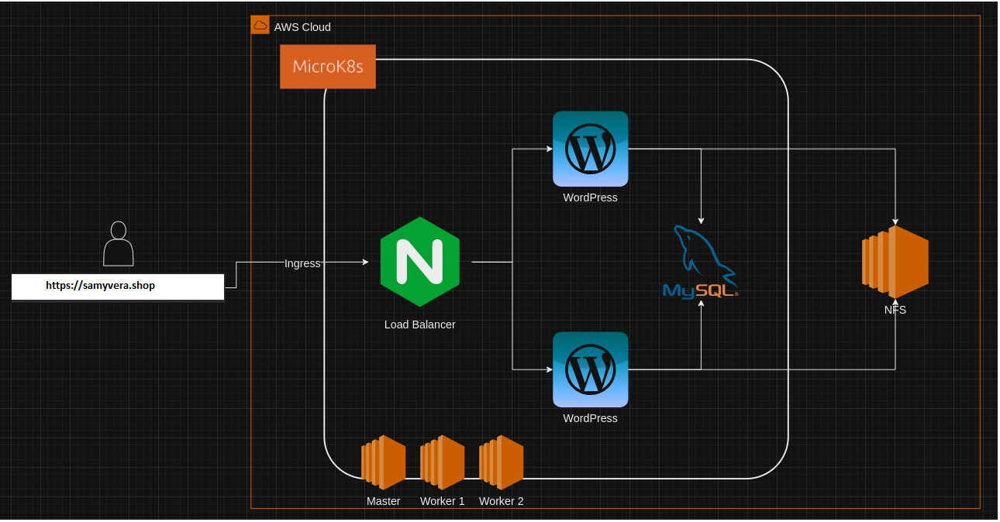
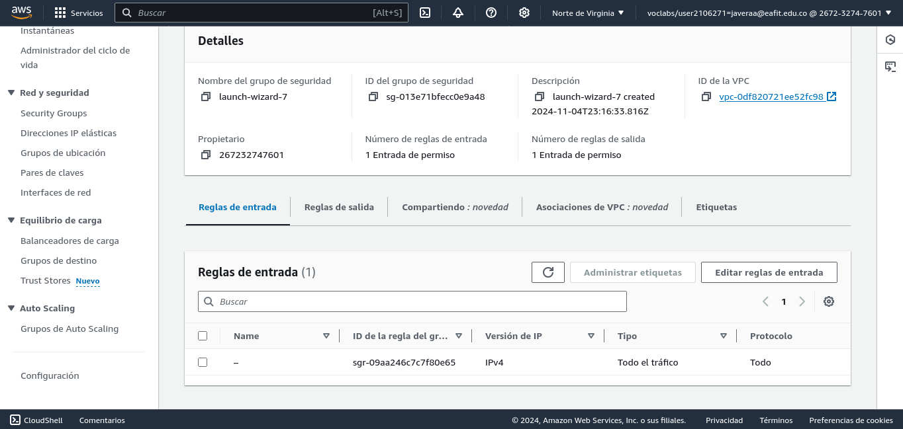
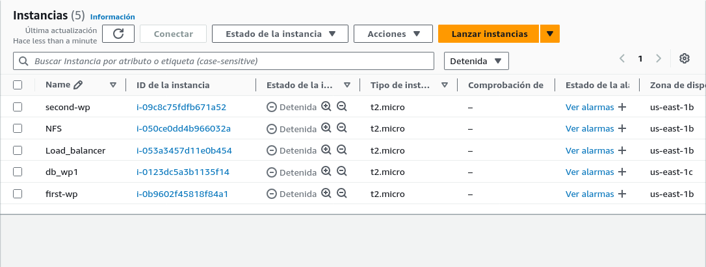
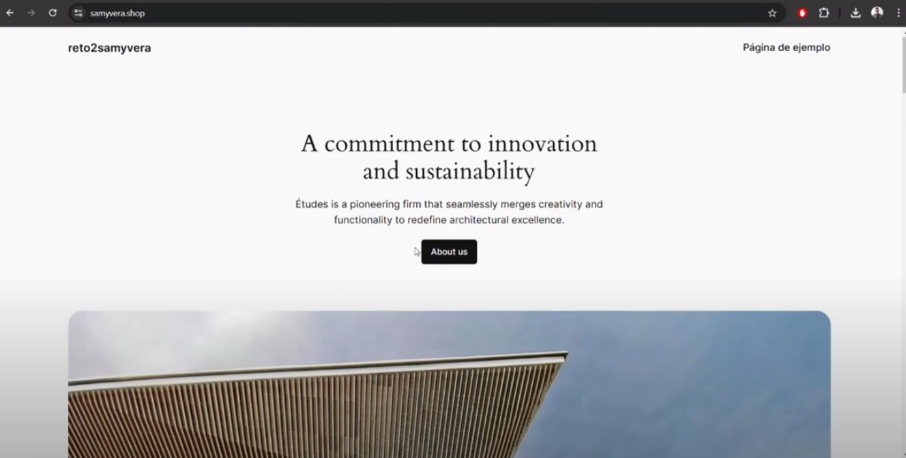

# Info de la materia: st0263 <nombre>

# Estudiante(s): 
### Samuel Garcia Correa, Sgarciac6@eafit.edu.co
 ### Juan Andres Vera Alvarez, javeraa@eafit.edu.co

# Profesor: Alvaro Ospina, aeospinas@eafit.edu.co

# Proyecto 2 – Cluster Kubernetes

# 1. Breve descripción de la actividad

En este proyecto, implementamos un CMS empleando la tecnología de Kubernetes, creando un clúster con un mínimo de 3 máquinas virtuales (master y workers) usando MicroK8s. Desplegamos una aplicación WordPress con MicroK8s en AWS. En AWS, se crearon el master y los workers para utilizar el software de MicroK8s, lo cual nos permite la creación de un clúster propio de Kubernetes. También se creó una máquina como servidor NFS para que WordPress y la base de datos tuvieran persistencia en caso de que algunos de los pods fallen. Adicionalmente, el proyecto incluye su propio dominio y certificado SSL.

## 1.1. Que aspectos cumplió o desarrolló de la actividad propuesta por el profesor (requerimientos funcionales y no funcionales)

* Cluster de kubernetes creado con microk8s, se uso una instancia Master, dos instancias Worker
* Crear nuestro propio dominio (proyecto2.andrescaro.tech)
* Certificado SSL
* Capa de acceso con microk8s Ingress
* Instancias de Wordpress con sus deployment, service, pv y pvc
* Un servidor NFS para los archivos en una instancia de externa al cluster


# 2. Información general de diseño de alto nivel, arquitectura, patrones, mejores prácticas utilizadas.
A continuación se observa el diagrama de la arquitectura usada para nuestro proyecto.



Como podemos ver en el diagrama se puede acceder a la página web por medio de nuestro dominio, el cual apunta a un servidor en aws que tiene como punto de entrada el ingress, aquí se configuro el https obteniendo el certificado SSL. Este Ingress nos redirige al servicio de wordpress. Estos pods apuntan a un servicio de la base de datos para hacer el CRUD necesario. También se tiene el NFS para guardar los datos tanto del wordpress como de la base de datos.


# 3. Descripción del ambiente de desarrollo y técnico: lenguaje de programación, librerias, paquetes, etc, con sus numeros de versiones.

Se utilizó el software de microk8s para configurar el cluster. Para crear las maquinas virtuales se utilizó la nube de AWS. Las versiones de las imagenes de wordpress y mysql son estas:

- docker.io/bitnami/mysql:8.0

- wordpress

Para el caso del NFS se utilizó la versión 4.1

Para este proyecto se crearon 4 instancias en AWS, una para el master, dos para los workers y una para el servidor NFS. Cada una de ellas usa la imagen de Ubuntu 24.04 LTS. A continuacion se detalla cada uno de los pasos.
## 3.1. Creacion de la VPC.
Para la VPC creamos una VPC con 2 subnets publicas.

## 3.2. Creación del grupo de seguridad

Para el grupo de seguridad sse creo con reglas publicas.
## 3.3. Creacion de instancias.
Para todas las intancias creadas se uso la misma configuracion.

Luego de creadas cambiamos el tipo de instacia a medium con 2 CPU y 8 de ram, con almacenamiento de 25 GB.

Estas fueron las intancias creadas.
  * 3.3.1 WP-MASTER
  * 3.3.2 WP-WORKER1
  * 3.3.3 WP-WORKER2
  * 3.3.4 WP-NFS
Para la instancia del master se creo una IP elastica para que no cambiara con los reinicios del laboratorio.

## 3.4. Configuracion de las instancias.

Los siguientes comandos se corren para todas las instancias, esto es una configuracion general.

* sudo apt update
* sudo apt upgrade -y
* sudo snap install microk8s --classic --channel=1.30/stable
* sudo usermod -aG microk8s $USER
* mkdir -p ~/.kube
* sudo chown -f -R $USER ~/.kube
* (Reiniciar terminal)
* microk8s status --wait-ready
* microk8s enable dashboard dns registry istio ingress
* sudo apt install nfs-common

[Descargar MicroK8s](https://microk8s.io/) Este instructivo se puede ver comandoss anteriores para la instalacion de microK8s.

## 3.5 Conectar cada uno de los workers al cluster.
En el master ejecutar este comando para establecer una conexion:
* microk8s add-node
Te debería salir algo como esto:
```
From the node you wish to join to this cluster, run the following:
microk8s join 192.168.1.230:25000/92b2db237428470dc4fcfc4ebbd9dc81/2c0cb3284b05

Use the '--worker' flag to join a node as a worker not running the control plane, eg:
microk8s join 192.168.1.230:25000/92b2db237428470dc4fcfc4ebbd9dc81/2c0cb3284b05 --worker

If the node you are adding is not reachable through the default interface you can use one of the following:
microk8s join 192.168.1.230:25000/92b2db237428470dc4fcfc4ebbd9dc81/2c0cb3284b05
microk8s join 10.23.209.1:25000/92b2db237428470dc4fcfc4ebbd9dc81/2c0cb3284b05
microk8s join 172.17.0.1:25000/92b2db237428470dc4fcfc4ebbd9dc81/2c0cb3284b05
```
En cada uno de los workers ejecutar el segundo comando que se muestra en el master, esto con el fin de agregar al cluster los workers.


## 3.6 Crear NFS
Se debe seguir el siguiente tuturial corriendo los comandos exclusivamente para el NFS https://microk8s.io/docs/how-to-nfs
Esto se hace en otra instancia de AWS enfocada solo para el NFS.

## 3.7. Agregart CSI en el nodo master para el NFS.
Seguir esta documentacion https://microk8s.io/docs/how-to-nfs apartado `Install the CSI driver for NFS`

## 3.8. Crear manifiestos necesarios en el master para el NFS
Necesitaremos crear los manifiestos de `StorageClass` y `PersistentVolumeClaim` usando el nfs-csi StorageClass. Estos manifiesto estan en la carpeta `nfs-manifests` de este repositorio
### 3.8.1 Crear StorageClass para el NFS.
```yaml
# sc-nfs.yaml
---
apiVersion: storage.k8s.io/v1
kind: StorageClass
metadata:
  name: nfs-csi
provisioner: nfs.csi.k8s.io
parameters:
  server: 10.0.0.6
  share: /srv/nfs
reclaimPolicy: Delete
volumeBindingMode: Immediate
mountOptions:
  - hard
  - nfsvers=4.1

```

* Se corre el siguiente comando para aplicar el manifiesto `microk8s kubectl apply -f - < sc-nfs.yaml`
* Para validar que el recurso se creo de manera exitosa correr `microk8s kubectl get storageclass`
### 3.8.2 Crear PersistentVolumeClaim usando el nfs-csi storage class.
```yaml
# pvc-nfs.yaml
---
apiVersion: v1
kind: PersistentVolumeClaim
metadata:
  name: my-pvc
spec:
  storageClassName: nfs-csi
  accessModes: [ReadWriteOnce]
  resources:
    requests:
      storage: 7Gi

```
* Se corre el siguiente comando para aplicar el manifiesto `microk8s kubectl apply -f - < pvc-nfs.yaml`

* Para validar que el recurso se creo de manera exitosa correr `microk8s kubectl get persistentvolumeclaim`

Si todo fue configurada de manera correcta deberias poder ver el recurso creado.
```microk8s kubectl describe pvc my-pvc```

Y ver el volumen provisionado exitosamente:
```
Name:          my-pvc
Namespace:     default
StorageClass:  nfs-csi
Status:        Bound
Volume:        pvc-5676d353-4d46-49a2-b7ff-bdd4603d2c06
Labels:        <none>
Annotations:   pv.kubernetes.io/bind-completed: yes
               pv.kubernetes.io/bound-by-controller: yes
               volume.beta.kubernetes.io/storage-provisioner: nfs.csi.k8s.io
               volume.kubernetes.io/storage-provisioner: nfs.csi.k8s.io
Finalizers:    [kubernetes.io/pvc-protection]
Capacity:      5Gi
Access Modes:  RWO
VolumeMode:    Filesystem
Used By:       <none>
Events:
  Type     Reason                 Age                    From                                                           Message
  ----     ------                 ----                   ----                                                           -------
  Normal   ExternalProvisioning   2m59s (x2 over 2m59s)  persistentvolume-controller                                    waiting for a volume to be created, either by external provisioner "nfs.csi.k8s.io" or manually created by system administrator
  Normal   Provisioning           2m58s (x2 over 2m59s)  nfs.csi.k8s.io_andromeda_61e4b876-324d-4f52-a5c3-f26047fbbc97  External provisioner is provisioning volume for claim "default/my-pvc"
  Normal   ProvisioningSucceeded  2m58s                  nfs.csi.k8s.io_andromeda_61e4b876-324d-4f52-a5c3-f26047fbbc97  Successfully provisioned volume pvc-5676d353-4d46-49a2-b7ff-bdd4603d2c06
```

## 3.9. Configurar manifiestos de mysql
 * Se debe correr el siguiente comando en el master para tener los manifiestos organizados ```mkdir mysql-manifests```
 * cd mysql-manifests
 * Se deben crear los siguiente manifiestos
  ```yaml
  # mysql-deployment.yaml
---
apiVersion: apps/v1 
kind: Deployment
metadata:
  name: wordpress-mysql
  labels:
    app: wordpress
spec:
  selector:
    matchLabels:
      app: wordpress
      tier: mysql
  strategy:
    type: Recreate
  template:
    metadata:
      labels:
        app: wordpress
        tier: mysql
    spec:
      containers:
      - name: mysql
        image: docker.io/bitnami/mysql:8.0
        env:
        - name: MYSQL_ROOT_PASSWORD
          value: telematicapwd
        - name: MYSQL_DATABASE
          value: wordpressdb
        - name: MYSQL_USER
          value: admin
        - name: MYSQL_PASSWORD
          value: telematicapwd
        ports:
        - containerPort: 3306
          name: mysql
        volumeMounts:
        - name: mysql-persistent-storage
          mountPath: /var/lib/mysql
      volumes:
      - name: mysql-persistent-storage
        persistentVolumeClaim:
          claimName: mysql-pvc
  ```
  ```yaml
  # mysql-pv.yaml
---
apiVersion: v1
kind: PersistentVolume
metadata:
  name: mysql-pv
spec:
  capacity:
    storage: 7Gi
  volumeMode: Filesystem
  accessModes:
    - ReadWriteMany
  persistentVolumeReclaimPolicy: Retain
  storageClassName: nfs-csi
  nfs:
    server: 10.0.0.6
    path: /srv/nfs
  ```
```yaml
# mysql-pvc.yaml
---
apiVersion: v1
kind: PersistentVolumeClaim
metadata:
  name: mysql-pvc
  labels:
    app: mysql
spec:
  accessModes:
    - ReadWriteMany
  storageClassName: nfs-csi
  resources:
    requests:
      storage: 7Gi
```
```yaml
# mysql-service.yaml
---
apiVersion: v1
kind: Service
metadata:
  name: mysql
  labels:
    app: wordpress
spec:
  ports:
    - port: 3306
  selector:
    app: wordpress
    tier: mysql
  clusterIP: None
```
 * Luego se debe correr el siguiente comando para aplicar todos los manifiestos, debemos esperar un momento a que se ejecute todo.
 ```microk8s kubectl apply -f .```
 * Validamos el estado de ejecuccion con `microk8s kubectl get pods`


## 3.10. Configurar manifiestos de wordpress
* Se debe correr el siguiente comando en el master para tener los manifiestos organizados ```mkdir wordpress-manifests```
* Luego,  ```cd wordpress-manifests```
* Se deben crear los siguiente manifiestos
```yaml
# wp-deployment.yaml
---
apiVersion: apps/v1
kind: Deployment
metadata:
  name: wordpress
  labels:
    app: wordpress
spec:
  replicas: 2
  selector:
    matchLabels:
      app: wordpress
      tier: frontend
  strategy:
    type: Recreate
  template:
    metadata:
      labels:
        app: wordpress
        tier: frontend
    spec:
      containers:
      - image: wordpress
        name: wordpress
        env:
        - name: WORDPRESS_DB_HOST
          value: mysql
        - name: WORDPRESS_DB_PASSWORD
          value: telematicapwd
        - name: WORDPRESS_DB_USER
          value: root
        - name: WORDPRESS_DB_NAME
          value: wordpressdb
        - name: WORDPRESS_DEBUG
          value: "1"
        ports:
        - containerPort: 80
          name: wordpress
        volumeMounts:
        - name: wordpress-persistent-storage
          mountPath: /var/www/html
      volumes:
      - name: wordpress-persistent-storage
        persistentVolumeClaim:
          claimName: wordpress-pvc
```
```yaml
# wp-pv.yaml
---
apiVersion: v1
kind: PersistentVolume
metadata:
  name:  wordpress-pv
spec:
  capacity:
    storage: 7Gi
  volumeMode: Filesystem
  accessModes:
    - ReadWriteMany
  persistentVolumeReclaimPolicy: Retain
  storageClassName: nfs-csi
  nfs:
    server: 10.0.0.6
    path: /srv/nfs
```
```yaml
# wp-pvc.yaml
---
apiVersion: v1
kind: PersistentVolumeClaim
metadata:
  name: wordpress-pvc
  labels:
    app: wordpress
spec:
  accessModes:
    - ReadWriteMany
  storageClassName: nfs-csi
  resources:
    requests:
      storage: 7Gi
```
```yaml
# wp-service.yaml
---

apiVersion: v1
kind: Service
metadata:
  name: wordpress
  labels:
    app: wordpress
spec:
  ports:
  - port: 80
  selector:
    app: wordpress
    tier: frontend

```
* Luego se debe correr el siguiente comando para aplicar todos los manifiestos, debemos esperar un momento a que se ejecute todo.
 ```microk8s kubectl apply -f .```
* Validamos el estado de ejecuccion con `microk8s kubectl get pods`

## 3.11. Configurar Ingress

* Se debe correr el siguiente comando en el master para tener los manifiestos organizados ```mkdir ingress```
* Luego,  ```cd ingress```
* Se deben crear los siguiente manifiestos
```yaml
# ingress.yaml
---
apiVersion: networking.k8s.io/v1
kind: Ingress
metadata:
  name: http-ingress
  labels:
    app: wordpress
spec:
  rules:
  - http:
      paths:
      - pathType: Prefix
        path: "/"
        backend:
          service:
            name: wordpress
            port:
              number: 80
```
* Luego se debe correr el siguiente comando para aplicar todos los manifiestos, debemos esperar un momento a que se ejecute todo.
 ```microk8s kubectl apply -f .```
* Validamos el estado de ejecuccion con `microk8s kubectl get pods`


Con todo lo anterior podemos acceder a la IP Publica de nuestro master y ya deberiamos poder ver el instalador de wordpress funcionando.

## 3.12. Configurar dominio y certificado SSL

* Agregar el registro de la IP pública de la máquina MASTER en nuestro servidor DNS, con el fin de que pueda resolver el dominio y mappearlo al MASTER de manera correcta.
* Ejecutar los siguiente comandos 
  * ```microk8s kubectl apply -f https://github.com/cert-manager/cert-manager/releases/download/v1.8.0/cert-manager.crds.yaml```
  * ```microk8s kubectl create namespace cert-manager```
  * ```microk8s kubectl apply -f https://github.com/cert-manager/cert-manager/releases/download/v1.8.0/cert-manager.yaml```
  * Validamos la creación exitosa de 3 pods con `microk8s kubectl get pods -n=cert-manager`
  * Validamos los logs `microk8s kubectl logs -n cert-manager -l app=cert-manager`
  * Ahora ```mkdir ssl```
  * ``cd ssl``
  * Creamos 2 claves para los archivos `cluster-issuer-staging.yaml` y `cluster-issuer.yaml` con:
    - `openssl genrsa -out letsencrypt-staging.pem 2048`
    - `openssl genrsa -out letsencrypt-private-key.pem 2048`
  * Creamos los secretos:
    - `sudo microk8s kubectl create secret generic letsencrypt-staging --from-file=letsencrypt-staging.pem`
    - `microk8s kubectl create secret generic letsencrypt-private-key --from-file=letsencrypt-private-key.pem`

* Ahora debemos crear los manifiestos para el certificado SSL
```yaml
# cluster-issuer.yaml
---
apiVersion: cert-manager.io/v1
kind: ClusterIssuer
metadata:
  name: letsencrypt-prod
spec:
  acme:
    # The ACME server URL
    server: https://acme-v02.api.letsencrypt.org/directory
    # Email address used for ACME registration
    email: juanandresvera1@gmail.com
    # Name of a secret used to store the ACME account private key
    privateKeySecretRef:
      name: letsencrypt-private-key
    # Enable the HTTP-01 challenge provider
    solvers:
      - http01:
          ingress:
            class: public
```
```yaml
# cluster-issuer-staging.yaml
---
apiVersion: cert-manager.io/v1
kind: ClusterIssuer
metadata:
  name: letsencrypt-staging
spec:
  acme:
    email: juanandresvera1@gmail.com
    server: https://acme-staging-v02.api.letsencrypt.org/directory
    privateKeySecretRef:
      name: letsencrypt-staging
    solvers:
    - http01:
        ingress:
          class: public
```
* Ahora ejecutamos los siguientes comandos:
  * ```microk8s kubectl apply -f cluster-issuer-staging.yaml```
  * ``microk8s kubectl apply -f cluster-issuer.yaml``
  * Validamos el estado con `microk8s kubectl get clusterissuer`
* Ahora creamos el siguiente manifiesto:
```yaml
# ingress-routes.yaml
---
apiVersion: networking.k8s.io/v1
kind: Ingress
metadata:
  name: ingress-routes
  annotations:
    # Change this when staging already works for "letsencrypt-prod"
    cert-manager.io/cluster-issuer: "letsencrypt-staging"
spec:
  tls:
  - hosts:
#change to your domain
    - samyvera.shop
    secretName: tls-secret
  rules:
#change to your domain
  - host: samyvera.shop
    http:
      paths:
      - path: /
        pathType: Prefix
        backend:
          service:
            name: wordpress
            port:
              number: 80

```
* Aplicamos el manifiesto. ```microk8s kubectl apply -f ingress-routes.yaml```
* Validamos la creación del certificado. Para hacer esto debemos esperar un momento que pase de false a true  ```microk8s kubectl get certificate```
* Cuando pase a true ya podremos cambiar el `staging` del ingress-routes.yaml por `prod` y aplicar nuevamente el manifiesto.


# 4. Resultados obtenidos


Pantallazo de prueba:


### Referencias

* https://microk8s.io/docs/
* https://microk8s.io/docs/how-to-nfs
* https://microk8s.io/docs/addon-ingress
* https://youtu.be/DCoBcpOA7W4?si=Q63SI5JHYyuDcHA7
